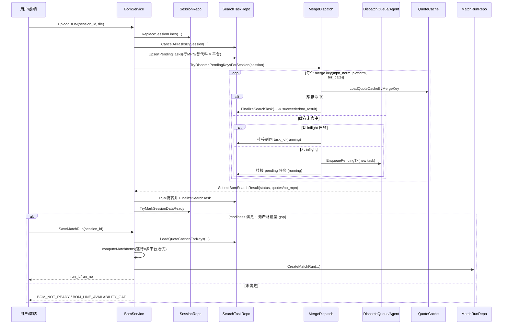

# BOM 配单算法与流程梳理

本文基于当前代码实现整理（`internal/service` + `internal/biz` + `internal/data`），用于快速理解「从导入到保存配单结果」的完整链路。

## 1. 端到端流程概览

1. 上传 BOM 后，服务将行数据写入 `bom_session_line`，并按 `行MPN(含替代料) × 平台` 生成 `bom_search_task`（`pending`）。
2. 触发合并调度（merge dispatch）：
   - 缓存命中则直接回填并完成任务；
   - 有在途任务则复用同一个 `caichip_task_id`；
   - 否则新建派发任务并挂接待处理行。
3. Agent 回传后，任务按状态机流转到终态（`succeeded/no_result/failed_terminal` 等）。
4. 每次任务完结都会尝试会话就绪判定（`TryMarkSessionDataReady`）。
5. 用户保存配单（`SaveMatchRun`）时，先校验 readiness 与 line availability，再执行逐行选优，最终落 `bom_match_run`。

## 2. 时序图（简化）



## 3. 搜索任务状态机

状态机由 `BomSearchTaskTransition` 统一定义（`internal/biz/bom_search_task_fsm.go`）。

- 典型路径：`pending -> running -> succeeded | no_result | failed_terminal`
- 失败重试路径：`running -> failed_retryable -> pending -> ...`
- 也支持 `cancelled`、`skipped` 终态。

该状态机用于约束回写时的合法迁移，防止任务状态被异常覆盖。

## 4. 会话就绪判定（Readiness）

就绪逻辑在 `ReadinessFromTasks` + `TryMarkSessionDataReady`：

- `lenient`：每个「行 × 平台」任务都到终态即可。
- `strict`：在 lenient 基础上，每行至少一个平台 `succeeded`。
- strict 不满足时，会话可被标记为 `blocked`。

## 5. 单行配单算法（核心）

核心函数：`PickBestQuoteForLine`（`internal/biz/bom_line_match.go`），由 `matchOneLine` 组织成跨平台选优。

### 5.1 单平台候选过滤

对某行在某平台的报价行，依次过滤：

1. **型号匹配**：标准化后必须等于 BOM 型号。
2. **封装匹配**：BOM 提供封装时，报价封装标准化后必须一致。
3. **厂牌匹配（严格）**：BOM 有厂牌时，双方先做 canonical 归一后必须相同；BOM 厂牌别名未命中会直接判该行失败。
4. **价格可比性**：能从主价/阶梯价中提取可比较单价（结合 MOQ/数量）。
5. **汇率可用性**：可换算到基准币（默认 CNY）。

### 5.2 排序与选优

候选生成后按 `MatchSortKey` 比较，主要维度：

1. 量化后基准币单价（低优先）
2. 交期（短优先）
3. 库存（高优先）
4. 平台 ID（稳定 tie-break）

### 5.3 原型号与替代型号策略

`matchOneLine` 先用原型号跑所有平台；若无候选且有替代型号，再跑替代型号；最终在全平台候选中选全局最优。仍无候选则返回 `no_match`。

## 6. 单行配单流程图

```mermaid
flowchart TD
    A[输入: 一行BOM + 所选平台 + quote cache] --> B[先用原型号跑所有平台]
    B --> C{有候选吗}
    C -- 否 --> D{有替代型号且不同于原型号?}
    D -- 是 --> E[用替代型号再跑所有平台]
    D -- 否 --> N[输出 no_match]
    E --> F{有候选吗}
    F -- 否 --> N

    C -- 是 --> G[平台内候选过滤]
    F -- 是 --> G
    G --> G1[型号归一匹配]
    G1 --> G2[封装匹配(若BOM有封装)]
    G2 --> G3[厂牌canonical匹配(若BOM有厂牌)]
    G3 --> G4[提取可比单价/MOQ/阶梯价]
    G4 --> G5[汇率换算到基准币]
    G5 --> H[生成排序键: 价/交期/库存/平台]

    H --> I[行内跨平台选全局最优]
    I --> J[输出 match_item: exact + subtotal]
```

## 7. Gap 与人工介入

通过 `computeLineAvailability` 与 `ListLineGaps` 识别缺口：

- `ready`
- `no_data`
- `collection_unavailable`
- `no_match_after_filter`
- `collecting`

人工处理两条路径：

1. `ResolveLineGapManualQuote`：人工补报价。
2. `SelectLineGapSubstitute`：选择替代料并重新触发任务。

保存 run 时，来源会区分为：

- `auto_match`
- `manual_quote`
- `substitute_match`
- `unresolved`

## 8. 关键数据落点

- `bom_session_line`：导入后的需求行
- `bom_search_task`：每行×平台搜索任务状态
- `t_bom_quote_item`/缓存快照：平台报价数据
- `bom_line_gap`：缺口与处理状态
- `bom_match_run` + `bom_match_result_item`：最终配单结果快照

## 9. 排障速查（现象 -> 优先检查点）

### 9.1 现象：`SaveMatchRun` 返回 `BOM_NOT_READY`

- 优先检查 `bom_session.import_status` 是否仍为 `parsing`。
- 再看 `bom_session.status` 是否为 `data_ready`；若是 `blocked`，继续看 strict 条件是否满足。
- 拉取会话任务快照，核对是否仍存在非终态任务（`pending/running/failed_retryable`）。
- 常见原因：
  - 导入刚完成，调度未跑完；
  - 某平台任务卡在重试链路；
  - readiness_mode 为 strict，但部分行无 `succeeded` 平台。

### 9.2 现象：`SaveMatchRun` 返回 `BOM_LINE_AVAILABILITY_GAP`

- 先看 `GetReadiness` / `computeLineAvailability` 的汇总结果。
- 找出 gap 行状态：`no_data`、`collection_unavailable`、`no_match_after_filter`。
- 常见原因：
  - 平台回传 `no_result`（无数据）；
  - 平台任务失败终态/被跳过；
  - 有原始报价，但被型号/封装/厂牌/价格过滤后无可用候选。

### 9.3 现象：行状态是 `no_match_after_filter`

- 确认该行是否 `HasRawQuote=true` 且 `HasUsableQuote=false`。
- 用同一行参数复核 `PickBestQuoteForLine` 输入：
  - `BomMpn` / `BomPackage` / `BomMfr`；
  - 该平台 `QuoteRows`；
  - 汇率、基准币、rounding 配置。
- 常见原因：
  - BOM 厂牌未命中别名（`bom_manufacturer_alias_miss`）；
  - 报价厂牌 canonical 与 BOM 不一致；
  - 报价能解析出原始价格但无法形成可比价；
  - 汇率缺失导致候选全部被淘汰。

### 9.4 现象：任务长期停留在 `pending` / `running`

- 检查是否触发了 `TryDispatchPendingKeysForSession`。
- 检查 merge key 是否被正确挂接到 inflight 任务（`caichip_task_id` 是否为空）。
- 检查调度队列中是否存在对应 dispatch task，以及 agent 是否在线可拉取。
- 常见原因：
  - merge dispatch 未触发或事务回滚；
  - 任务已入队但 agent 能力不匹配（队列/标签/脚本版本）；
  - 外部平台抓取异常导致回传缺失。

### 9.5 现象：有报价但最终没被选中

- 对比同一行多平台候选的排序键：价格、交期、库存、平台 ID。
- 检查该报价是否在过滤阶段被剔除（先过滤，再排序）。
- 常见原因：
  - 价格更高或交期更差；
  - 封装/厂牌不匹配导致未进入候选；
  - 候选可比价来源不同（主价/阶梯价）导致比较结果变化。

### 9.6 现象：替代料没有生效

- 确认该行原型号是否已出现候选；若已有候选，不会走替代型号兜底。
- 确认 `substitute_mpn` 非空且标准化后不等于原型号。
- 若是通过 gap 流程选择替代料，确认是否已触发 `UpsertPendingTasks + tryMergeDispatchSession`。
- 常见原因：
  - 原型号已有可用候选（逻辑上不会再尝试替代）；
  - 替代料与原料标准化后相同；
  - 选择替代后任务尚未完成回写。

### 9.7 现象：`succeeded` 但仍无法配单

- 区分“任务 succeeded”和“行可用”：`succeeded` 仅表示平台任务完成，不等同于该行有可用报价。
- 重点看行级 `HasUsableQuote`，而不是只看任务状态。
- 常见原因：
  - 平台抓到原始报价但全被业务过滤；
  - strict 模式下某些行没有任一平台 `succeeded`；
  - 仍存在其它 gap 行阻塞。

## 10. 建议排障顺序（实操）

1. 看会话层：`import_status`、`session status`、`readiness_mode`。
2. 看任务层：是否全终态、是否有重试中任务。
3. 看行层：availability 分类与 gap 明细。
4. 看报价层：cache 命中、`quotes_json` 是否可解析。
5. 看算法层：把单行输入代入 `PickBestQuoteForLine` 复算。

