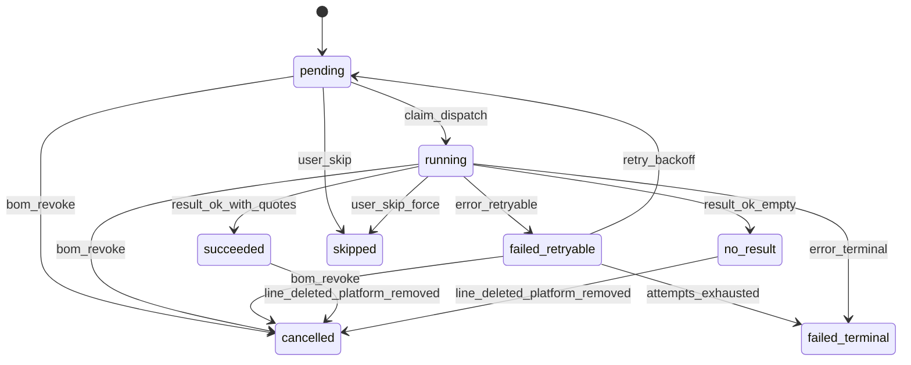

# BOM 货源搜索与配单 — 正式设计规格（节选）

> **范围：** 在 [产品需求要点](./2026-03-27-bom-sourcing-requirements.md) 基础上，补齐 **失败/跳过平台策略**、**搜索任务状态机**、**与 `caichip_dispatch_task` 的合并调度（多行共用 `caichip_task_id`）**、**Excel 列映射**；与现有表草案 [docs/schema/bom_mysql.sql](../../schema/bom_mysql.sql) 对齐字段命名习惯（`platform_id`、`state` 等）。**若与需求文档对同一策略的表述不一致，以需求文档为准。**
>
> **非目标：** 本文不绑定具体 REST/gRPC 路径；API 列表可在单独 spec 中展开。

---

## 1. 平台标识与可配置扩展

| `platform_id`（存库） | 说明 | 备注 |
|----------------------|------|------|
| `ickey` | 云汉芯城 | |
| `find_chips` | FindChips | 产品文档中亦写作 `find_chip` 时，**导入/前端统一映射为** `find_chips` |
| `hqchip` | HQChip | |
| `icgoo` | ICGOO | |
| `szlcsc` | 立创商城 | |

- **扩展：** 新增平台 = 配置表 `bom_platform_script` 增行 + Agent 脚本就绪；**不**改核心状态机枚举语义（见 §3）。
- **会话级勾选：** `bom_session.platform_ids`（JSON 数组）为 **本轮** 参与搜索的平台集合；与任务生成规则（§4）一致。

---

## 2. 「数据已准备」与失败 / 跳过 — 决策表

### 2.1 术语

| 术语 | 含义 |
|------|------|
| **平台终态** | 某 `(session, line MPN, platform)` 对应搜索任务达到 §3 中的 **完成类** 状态（`succeeded`、`no_result`、`failed_terminal`、`cancelled`、`skipped`）。 |
| **业务可报价** | 平台返回至少一条满足后续配单最小校验的报价（具体匹配规则见需求要点 §6；本文只定义就绪门槛）。 |
| **数据已准备** | BOM 单可进入配单流程（或「整单配单」）的前置条件名；存于 `bom_session.status` 的等价状态（如 `data_ready`），具体枚举与迁移在实现阶段锁定。 |

### 2.2 平台失败 / 超时 / 无结果 — 是否阻塞「已准备」

**默认策略（推荐基线）：** **不**因单一平台失败而无限阻塞整单；以 **「每个必选平台 × 每行」均到达平台终态** 为「搜索阶段完成」，再按下表决定是否允许标为 **数据已准备**。

| 场景 | 任务最终归类（见 §3） | 是否计为该行该平台「已尝试完毕」 | 整单可否标「数据已准备」 |
|------|----------------------|----------------------------------|---------------------------|
| 爬虫/脚本成功且有报价 | `succeeded` | 是 | 是（仍要求其他任务也终态） |
| 成功但无匹配报价 | `no_result` | 是 | 是 |
| 可重试错误（网络、429 等） | `failed_retryable` → 重试耗尽后 `failed_terminal` | 耗尽后为是 | 终态齐全即可 |
| 不可恢复错误（脚本异常、解析失败） | `failed_terminal` | 是 | 是 |
| **手动跳过平台**（用户对该行或整单勾选「跳过」） | `skipped` | 是（视为该平台不要求报价） | 是 |
| **整单取消某平台**（从 `platform_ids` 移除） | 未完成任务 **作废**（`cancelled`）；与需求 §4 一致，**不**依赖物理删除任务来清历史 | 是 | 是 |

### 2.3 「已准备」的两种产品模式（实现须显式配置或会话级策略）

| 模式 | 条件 | 适用 |
|------|------|------|
| **A. 宽松（默认）** | 所有 **当前 `platform_ids` 内** 平台 × **当前仍存在的行** 的搜索任务均为平台终态即可标「已准备」。 | 允许部分平台 `no_result` / `failed_terminal`，配单阶段再处理缺货。 |
| **B. 严格** | 在 A 基础上，额外要求：对每个 BOM 行，**至少一个**平台为 `succeeded`（有可用报价），否则整单 **不** 标「已准备」而标 `blocked` / `partial`（具体子状态名实现定）。 | 强依赖「每行必有货源」的业务。 |

**建议：** 会话级字段 `readiness_mode`: `lenient` | `strict`，默认 `lenient`。

### 2.4 超时

- **单次执行超时：** 由 Agent 调度层或脚本侧限制；超时事件将任务记入 `failed_retryable` 或直接进入 `failed_terminal`（按错误码表，实现定）。
- **整单 SLA：** 可选「最长等待时间」后触发 **自动将仍为 `running`/`pending` 的任务标为 `failed_terminal`（reason=timeout）** 或 **自动跳过** — 属运营策略，**须在配置中关闭/打开**，默认 **关闭**（避免误杀长尾平台）。

---

## 3. 搜索任务状态机（`bom_search_task.state`）

### 3.1 状态枚举

| 状态 | 说明 |
|------|------|
| `pending` | 已创建，尚未被调度/认领。 |
| `leased` / `running` | 二选一命名：已被 Agent 认领执行中（若与调度表共用 `leased`，可只在外层调度表体现，搜索任务仍用 `running`）。**本文建议：** 搜索任务仅用 `running` 表示执行中，与 [Agent 调度任务表](../../schema/agent_dispatch_task_mysql.sql) 的租约状态解耦。 |
| `succeeded` | 成功拿到结构化结果并写入 `bom_quote_cache`（或等价存储）。 |
| `no_result` | 执行成功但业务上无可用报价（空结果或明确「无此型号」）。 |
| `failed_retryable` | 可自动重试的失败（未超 `auto_attempt` 上限）。 |
| `failed_terminal` | 不可恢复或重试耗尽，不再自动派发。 |
| `cancelled` | BOM 变更或用户操作导致任务作废。 |
| `skipped` | 用户/规则显式跳过该平台（不计入缺报责任）。 |

### 3.2 转移（Mermaid）

### 3.3 与 `auto_attempt` / `manual_attempt`

- **`auto_attempt`：** 每次 `failed_retryable → pending` 或调度重派时 +1；达上限转 `failed_terminal`。
- **`manual_attempt`：** 用户点击「重试」仅重置该任务或从 `failed_terminal`/`skipped` 回到 `pending`（产品定）；计数独立，便于审计。

### 3.4 「数据已准备」轮询条件（汇总）

**V1 以定时任务扫描为主**（需求 §5）；可对单次任务完成 **额外发事件** 加速推进，但 **不能替代定时兜底**。对某 `session_id`，若 `readiness_mode=lenient`：

1. 对当前 `platform_ids` × 当前行集合，**不存在** `state ∈ {pending, running, failed_retryable}` 的任务（或等价：全部为完成类状态）；
2. 若 `readiness_mode=strict`，额外校验每行至少一平台 `succeeded`。

则 `bom_session.status ← data_ready`（并写 `updated_at`）。

### 3.5 调度合并：多行共用 `caichip_task_id`（同键单次真实抓取）

**目标：** 同一业务日内、多个 `bom_session` 存在 **相同 `(mpn_norm, platform_id, biz_date)`** 的搜索需求时，**至多触发一次** 真实的 Agent 抓取（**一条** `caichip_dispatch_task`，一个 `task_id`）；与 `bom_quote_cache` 主键 `(mpn_norm, platform_id, biz_date)` **全局一份缓存** 的设计一致。

**合并键（调度去重维度）：** `(mpn_norm, platform_id, biz_date)`。  
（`biz_date` 取自各会话的 `bom_session.biz_date`；若两单 `biz_date` 不同，则 **不合并**。）

#### 3.5.1 数据关系约定

- **允许多条** `bom_search_task` 行持有 **相同的** `caichip_task_id`（均等于 [caichip_dispatch_task.task_id](../../schema/agent_dispatch_task_mysql.sql)）。
- **`caichip_dispatch_task.task_id` 仍全局唯一**：合并后仍只有 **一行** 调度记录对应本次执行。
- **DDL：** **不得** 对 `bom_search_task.caichip_task_id` 施加 **唯一约束**；若历史迁移中存在 `UNIQUE(caichip_task_id)`，应移除以符合本策略。
- **`pending` 阶段** 允许 `caichip_task_id` 为 `NULL`；在成功 **挂接** 或 **入队** 后写入同一 `task_id`。

#### 3.5.2 入队与缓存命中

| 步骤 | 行为 |
|------|------|
| **A. 已有可用缓存** | 若 `bom_quote_cache` 在策略上仍有效（命中键 `(mpn_norm, platform_id, biz_date)`），**不入队** `caichip_dispatch_task`；将所有待完成的、同合并键且未 `cancelled` 的 `bom_search_task` **直接** 按缓存结果更新为 `succeeded` / `no_result`（或等价终态）。 |
| **B. 需真实抓取且尚无在途调度** | **插入一条** `caichip_dispatch_task`，生成唯一 `task_id`；凡本次应参与合并的 `bom_search_task`（同合并键、`pending`、未取消）**均写入相同** `caichip_task_id`，并进入 `running`（或与 §3.1 一致的执行中语义）。 |
| **C. 需真实抓取但已存在在途调度** | **禁止** 为同合并键再插第二条 `pending/leased` 调度行；新产生的 `bom_search_task` **只复用** 已存在行的 `task_id`，写入自身 `caichip_task_id`。 |

「在途」指：对应 `caichip_dispatch_task.state ∈ {pending, leased}`（或实现中等价状态），直至 `finished` / `cancelled` 后该合并键方可再次发起 **新一轮** 抓取（新 `task_id`）。

#### 3.5.3 Agent 回调与状态 Fan-out

- `SubmitTaskResult`（或等价接口）以 **`task_id`** 定位 **一次** 执行结果。
- 处理逻辑：
  1. **写/更新** `bom_quote_cache` **至多一次**（该合并键）。
  2. 查询 **所有** `caichip_task_id = task_id` 且 `state` 仍为执行中/等待结果、且 **未** `cancelled` / `skipped` 的 `bom_search_task`，**批量** 更新为同一业务终态（`succeeded` / `no_result` / `failed_*` 等，与结果一致）。
- **已作废**（`cancelled`）的业务行 **不参与** 回填，避免 BOM 变更后误更新。

#### 3.5.4 并发

- 多个请求同时为 **同一合并键** 首次入队时，须 **事务 + 唯一手段** 保证仅一条调度胜出，例如：
  - 对「合并键 → `task_id`」的协调行使用 `INSERT ... ON DUPLICATE` / 应用层锁 / `SELECT ... FOR UPDATE` 于辅助表；或
  - 依赖 `caichip_dispatch_task` 上基于合并键的 **唯一飞行中约束**（若引入辅助表或扩展字段表达合并键）。
- 败方事务应 **回读** 已存在的 `task_id` 并写回本方 `bom_search_task`。

#### 3.5.5 重试与重新搜索

- **自动重试**：若仍为 **同一次执行世代**（同一 `task_id` 重派租约），Fan-out 目标集合不变。
- **新的执行世代**（新 `task_id`）：仅应将 **仍需搜索** 的业务行挂到新 `task_id`；已终态行不得被覆盖。
- **手动重试 / 强制重搜**：可生成 **新** `task_id` 与新调度行；是否再次与同合并键其他会话合并，由实现决定（**建议** 仍走 §3.5.2 的合并规则以省抓取）。

#### 3.5.6 与 §3 状态机的关系

- 合并场景下，`pending → running` 由 **挂接 `task_id` / 认领调度** 触发；`running →` 终态由 **该 `task_id` 的结果** 对 **所有挂接行** 一并推进。
- **会话级就绪**（§3.4）仍按 **各 `session_id` 下** 任务是否全部终态判断，与是否共用调度无关。

---

## 4. BOM 变更时的任务增量（与状态联动）

| 变更 | 任务侧动作 |
|------|------------|
| 新增行 | 为 `(新行 MPN_norm × platform_ids)` 批量插入 `pending` 任务。 |
| 删除行 | 该行关联任务 **作废**（`cancelled`，软标记；**不**为清缓存而物理删任务）。**报价缓存与历史报价保留**（见需求 §4）。 |
| 改行（影响搜索的字段） | 旧任务 **作废**（`cancelled`），按新 MPN/平台集合新建 `pending`；**缓存与历史报价保留**，新抓取自然形成新键或新版本；不强制物理删 `bom_quote_cache`。 |
| `platform_ids` 增加 | 为所有现行补新平台任务 `pending`。 |
| `platform_ids` 减少 | 去掉的平台：相关未完成任务 **作废**（`cancelled`）；**已写入的缓存可保留** 供审计；配单只读当前 `platform_ids`。 |

---

## 5. 跳过平台的语义

- **行级跳过：** 仅某 `(line, platform)` 标 `skipped`，其它平台仍执行。
- **会话级关闭平台：** 从 `platform_ids` 移除并 `cancelled` 未完成任务；已终态任务可保留审计。
- **skips 是否影响「已准备」：** 已视为终态（§2.2），**不阻塞**宽松模式。

---

## 6. Excel 导入 — 列映射与校验

### 6.1 推荐列映射（表头别名不区分大小写，去首尾空格）

| 逻辑字段 | 必填 | 表头别名（任选其一命中） | 说明 |
|----------|------|--------------------------|------|
| `line_no` | 否 | `行号`、`序号`、`No`、`#`、`Line` | 缺省时按 Excel 物理行序从 1 递增。 |
| `mpn` | **是** | `型号`、`MPN`、`料号`、`Part`、`型号* ` | 空值 → **错误行**。 |
| `mfr` | 否 | `厂牌`、`制造商`、`品牌`、`MFR`、`Manufacturer` | |
| `package` | 否 | `封装`、`Package` | |
| `qty` | 否 | `数量`、`Qty`、`用量`、`Quantity` | 非数字 → 错误行；空可默认 `1`（产品定，**建议默认 1**）。 |
| `params` / `spec` | 否 | `参数`、`规格`、`Description`、`备注`、`参数说明` | 进 `extra_json` 或扩展列。 |
| `raw_text` | 否 | `原始文本`、`原文` | 整行备份。 |

### 6.2 校验与错误反馈

- **反馈结构：** `{ "ok": false, "errors": [ { "row": 12, "field": "mpn", "reason": "empty" }, ... ] }`（具体 JSON 与 HTTP 码在 API spec 定义）。
- **部分成功策略：** **默认**「全有或全无」事务导入；若需「跳过错误行导入其余」，须显式 query 参数 `partial=true` 并在响应中返回 `warnings` 数组。

### 6.3 与 `bom_session_line` 的对应

| Excel 逻辑字段 | 表字段 |
|----------------|--------|
| `line_no` | `line_no` |
| `mpn` | `mpn`（规范化 `mpn_norm` 在应用层生成，与 `bom_search_task.mpn_norm` 一致） |
| `mfr` | `mfr` |
| `package` | `package` |
| `qty` | `qty` |
| 其它 | `extra_json` |

---

## 7. 配单门禁（摘要）

- **默认：** 仅当 `bom_session.status == data_ready`（或等价）且 `readiness_mode` 条件满足时允许调用配单。
- **部分行配单（V1，需求 §6）：** 允许请求体携带 `line_id` 子集；仅所选行参与配单；**匹配规则为完全匹配**（规范化后相等），详见需求 §6。行级就绪与错误码在 API spec 中列明。

---

## 8. 文档索引

| 文档 | 用途 |
|------|------|
| [2026-03-27-bom-sourcing-requirements.md](./2026-03-27-bom-sourcing-requirements.md) | 产品需求要点（WHAT） |
| 本文 | 失败/跳过策略、状态机、**§3.5 合并调度**、Excel 映射、就绪判定（HOW） |
| [docs/schema/bom_mysql.sql](../../schema/bom_mysql.sql) | 表结构 |
| [docs/superpowers/plans/2026-03-27-bom-sourcing-implementation.md](../plans/2026-03-27-bom-sourcing-implementation.md) | 实现拆解计划 |
| [specs/README.md](./README.md) | 本目录总索引 |

---

## 9. 修订记录

| 日期 | 说明 |
|------|------|
| 2026-03-27 | 首版：从需求要点落地策略表、状态机、Excel 映射 |
| 2026-03-27 | 增加实现拆解计划索引：[2026-03-27-bom-sourcing-implementation.md](../plans/2026-03-27-bom-sourcing-implementation.md) |
| 2026-03-27 | 与需求 §4/§5/§6 对齐：任务作废+缓存保留、定时为主、部分行配单+完全匹配 |
| 2026-03-27 | §3.5：多 `bom_search_task` 共用同一 `caichip_task_id`，同 `(mpn_norm, platform_id, biz_date)` 单次真实抓取与 Fan-out |
| 2026-03-27 | 实现落地：按计划 [2026-03-27-bom-sourcing-implementation.md](../plans/2026-03-27-bom-sourcing-implementation.md) 完成 FSM、就绪判定、Excel 导入、data/service 与 HTTP 注册（`readiness_mode` 迁移见 `docs/schema/migrations/20260327_bom_readiness.sql`） |
