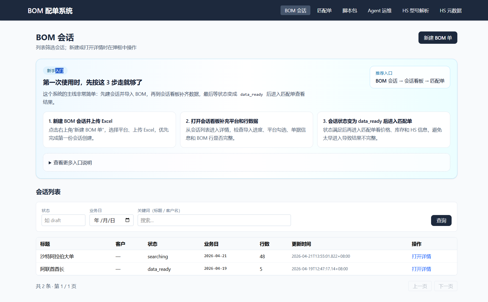
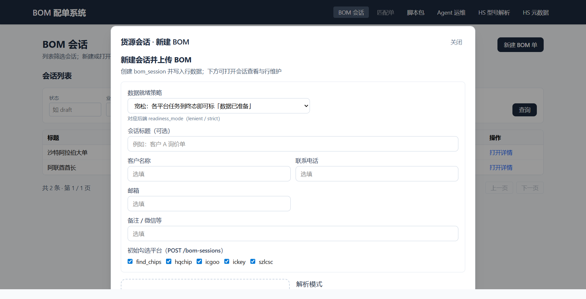
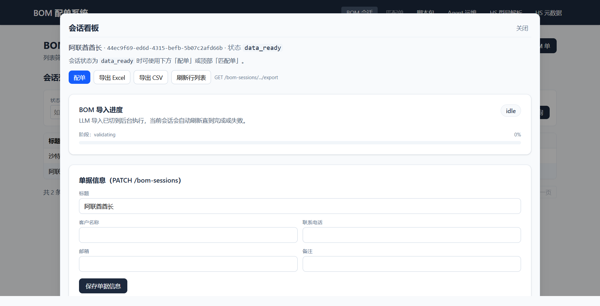
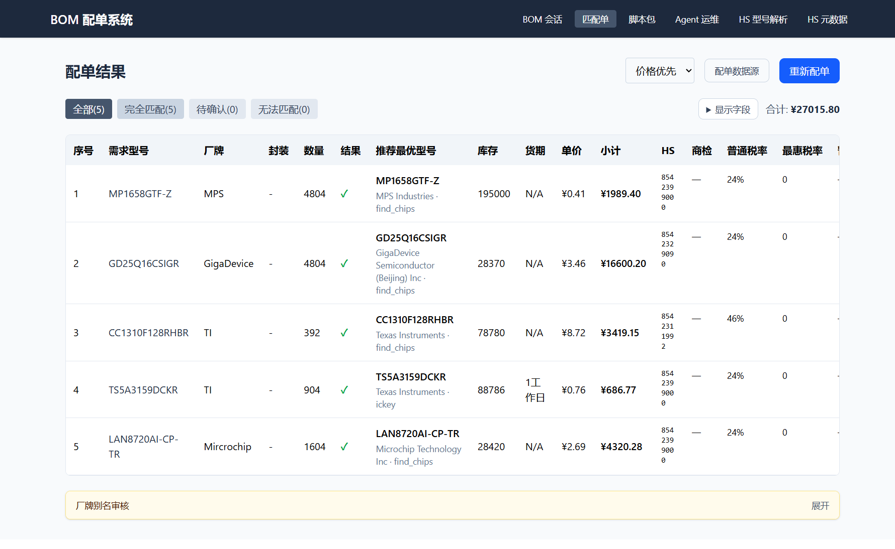
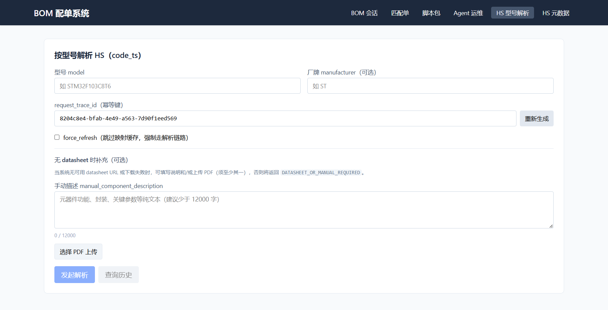
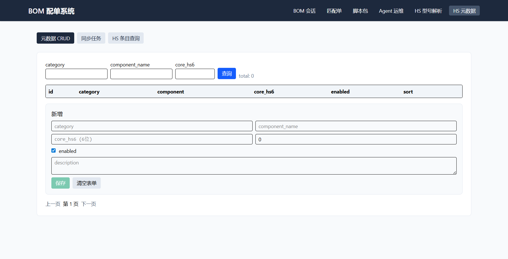
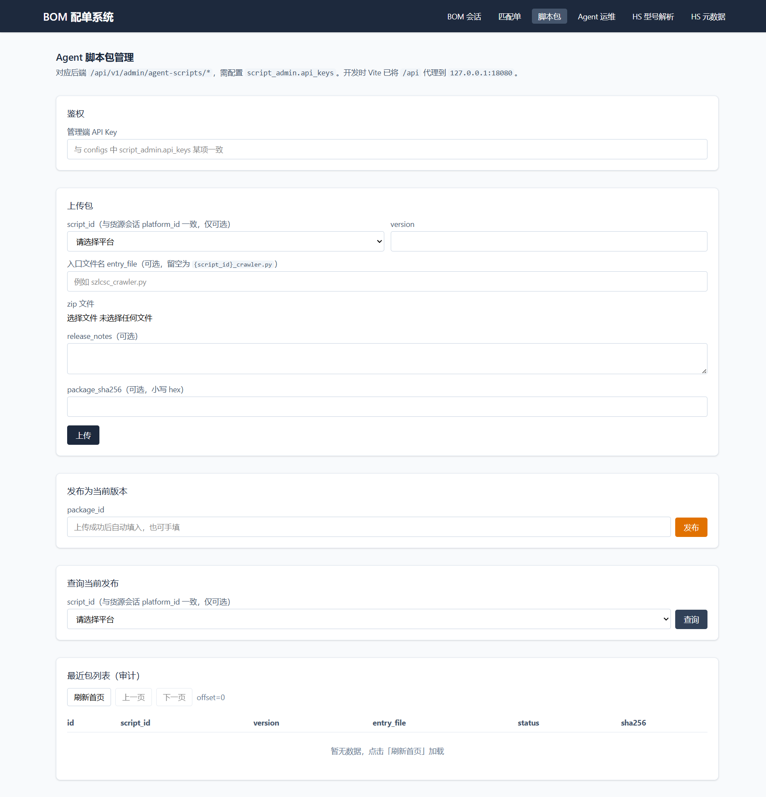
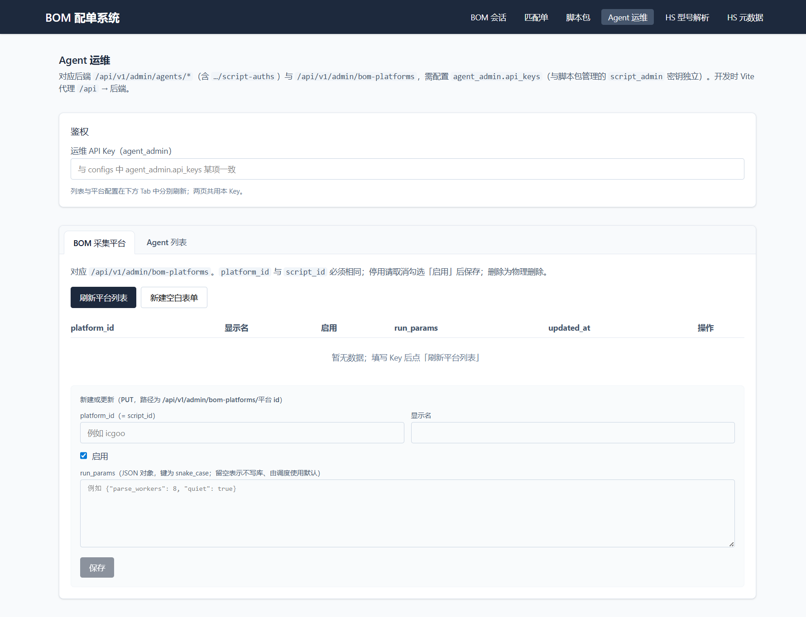

# 采芯协同平台用户使用手册

本文档面向业务用户、HS 维护人员和系统管理员，介绍 `caichip` 项目的实际使用方式。内容基于当前仓库内已经实现的 Web 页面、后端接口和配置文件整理，适合作为内部培训、交接和日常操作参考。

## 1. 系统概览

采芯协同平台当前主要包含 5 组能力：

- BOM 会话：创建会话、上传 BOM、维护行项目、选择采集平台、查看导入状态。
- 配单结果：基于会话结果进行报价比对、筛选、导出，并补充厂牌别名与 HS 信息。
- HS 型号解析：按型号和厂牌发起 HS 归类任务，查看候选结果，手工确认最终编码。
- HS 元数据管理：维护 HS 元数据、同步任务和 HS 条目查询。
- Agent 管理：管理采集脚本包、Agent 在线状态、脚本凭据和 BOM 平台配置。

默认 Web 顶部导航包含以下入口：

- `BOM 会话`
- `匹配单`
- `脚本包`
- `Agent 运维`
- `HS 型号解析`
- `HS 元数据`

## 2. 适用角色

建议按角色理解各页面用途：

| 角色 | 主要使用页面 | 典型工作 |
| --- | --- | --- |
| 业务操作员 | `BOM 会话`、`匹配单` | 导入 BOM、补充会话信息、发起配单、导出结果 |
| 归类/关务人员 | `HS 型号解析`、`HS 元数据` | 补充 HS 编码、查看候选、确认归类结果 |
| 平台管理员 | `脚本包`、`Agent 运维` | 发布采集脚本、查看 Agent 状态、管理平台配置和脚本账号 |

如果你只是做 BOM 上传和配单，通常只需要关注前两个页面。

## 3. 快速启动

系统支持两种常见启动方式。

### 3.0 界面速览

下图是当前前端首页的真实界面，顶部导航已经把主要功能区分开了，普通用户一般从 `BOM 会话` 进入，管理员则更多使用 `脚本包` 和 `Agent 运维`。

现在首页右上角提供了单独的“使用指南”入口，新用户第一次进入时可以先点进去看 3 分钟快速上手；该页面除了静态截图，还补充了“新建 BOM 单上传 + 打开会话看板”的动图演示。



### 3.1 Docker Compose 启动

适合本地演示、联调和测试环境。

1. 在仓库根目录执行：

```bash
docker compose up -d --build
```

2. 启动后默认会得到以下服务：

- MySQL：`3306`
- Redis：`6379`
- 后端 HTTP：`18080`
- 后端 gRPC：`19090`
- Web：`8080`

3. 访问地址：

- Web 页面：`http://localhost:8080`
- 后端 API：`http://localhost:18080`

4. 常用运维命令：

```bash
docker compose ps
docker compose logs -f server
docker compose restart server
docker compose down
docker compose down -v
```

说明：

- Docker 模式下后端默认读取 `configs/config.docker.yaml`
- MySQL 使用容器地址 `mysql:3306`
- Redis 使用容器地址 `redis:6379`

### 3.2 本地开发模式启动

适合开发、调试和页面联调。

1. 启动后端：

```bash
go run ./cmd/server/...
```

2. 启动前端：

```bash
cd web
npm install
npm run dev
```

3. 默认访问地址：

- 前端开发页：`http://localhost:5173`
- 后端 API：`http://127.0.0.1:18080`

说明：

- 本地模式下后端默认读取 `configs/config.yaml`
- 前端通过 Vite 代理把 `/api` 转发到 `127.0.0.1:18080`

## 4. 关键配置说明

以下配置决定了某些功能是否可用。

### 4.1 基础配置

主要文件：

- `configs/config.yaml`
- `configs/config.docker.yaml`

重点字段：

- `data.database.dsn`：MySQL 连接串
- `data.redis.addr`：Redis 地址
- `server.http.addr`：HTTP 监听地址，默认 `0.0.0.0:18080`
- `server.grpc.addr`：gRPC 监听地址，默认 `0.0.0.0:19090`

### 4.2 BOM 导入相关

- `openai.api_key`
- `openai.base_url`
- `openai.model`

说明：

- 只有配置了 `openai.api_key`，上传页中的“大模型解析”模式才能正常使用。
- 未配置 OpenAI 时，建议使用“自定义映射”模式导入 Excel。

### 4.3 Agent 与管理后台相关

- `agent.enabled`
- `script_store.enabled`
- `script_admin.api_keys`
- `agent_admin.api_keys`

说明：

- `脚本包` 页面依赖 `script_admin.api_keys`
- `Agent 运维` 页面依赖 `agent_admin.api_keys`
- 如果没有配置对应 API Key，页面可以打开，但管理操作无法成功提交

### 4.4 HS 相关

- `hs_query_api_url`
- `hs_auto_accept_threshold`
- `hs_resolve_max_candidates`
- `hs_resolve_retry_max`

说明：

- HS 型号解析页会根据当前 HS 配置返回候选结果和自动判定结果
- 若你只做人工确认，可以先不深究这些阈值的含义

## 5. 推荐的日常业务流程

大多数业务用户可按下面顺序操作：

1. 进入 `BOM 会话`
2. 新建会话并上传 Excel
3. 在会话看板中确认导入状态、平台选择和行项目
4. 会话状态进入 `data_ready` 后，点击进入 `匹配单`
5. 在匹配结果中筛选、确认报价、补厂牌别名
6. 对缺少 HS 的料号进入 `HS 型号解析`
7. 必要时导出 `xlsx` 或 `csv`

如果涉及平台代理采集或脚本分发，再使用管理员页面。

## 6. BOM 会话

`BOM 会话` 是业务使用的主入口。

### 6.1 新建会话并上传 BOM

点击页面右上角的“新建 BOM 单”后，会打开上传弹窗。你需要填写以下内容：

- 数据就绪策略
- 会话标题
- 客户名称
- 联系电话
- 邮箱
- 备注 / 微信等附加信息
- 初始勾选的平台
- Excel 文件
- 解析模式

实际界面如下，上传区、平台勾选和解析模式都集中在一个弹窗里，适合按顺序一次填完：



### 6.2 数据就绪策略

当前支持两种策略：

- `lenient`：各平台任务进入终态即可视为“数据已准备”
- `strict`：每一行至少要有一个平台搜索成功，才视为“数据已准备”

建议：

- 想尽快看到结果时，优先使用 `lenient`
- 对结果完整性要求较高时，使用 `strict`

### 6.3 选择采集平台

当前前端内置的平台标识包括：

- `find_chips`
- `hqchip`
- `icgoo`
- `ickey`
- `szlcsc`

至少需要勾选一个平台，否则无法提交会话。

### 6.4 解析模式

上传页当前支持两种解析方式：

#### 大模型解析

适合来源复杂、表头不稳定的 Excel。

特点：

- 服务端异步解析
- 页面会显示导入进度卡片
- 依赖 `openai.api_key`
- 文件过大或结构异常时可能被拒绝

#### 自定义映射

适合表头清晰、想要稳定导入的 Excel。

特点：

- 上传前先读取首行表头
- 由用户手工指定列映射
- 至少要映射“型号”列
- 一般会更可控、更适合规范模板

支持映射的字段包括：

- `model`
- `manufacturer`
- `package`
- `quantity`
- `params`

### 6.5 文件要求

上传组件当前支持：

- `.xlsx`
- `.xls`

建议：

- 每个文件只保留一个核心数据工作表
- 尽量让型号、厂牌、封装、数量列语义清晰
- 如果使用自定义映射，优先保证首行表头整洁、无合并单元格

### 6.6 导入状态说明

如果使用“大模型解析”，会话看板中会出现导入状态卡，常见状态如下：

- `parsing`：导入中
- `ready`：导入完成
- `failed`：导入失败

状态卡还会展示：

- 进度百分比
- 当前阶段
- 服务端返回的提示信息
- 失败时的错误码和错误详情
- 最近更新时间

### 6.7 会话列表

会话列表支持以下筛选条件：

- 状态
- 业务日期
- 关键字搜索

关键字通常可匹配标题或客户名称。

### 6.8 会话看板

打开某个会话后，可以在看板中完成以下操作：

- 编辑会话标题和客户信息
- 修改联系电话、邮箱和附加备注
- 调整平台勾选
- 查看导入状态
- 查看 BOM 行项目
- 新增一行
- 编辑一行
- 删除一行
- 导出 Excel
- 导出 CSV
- 对缺失平台任务进行重试

会话看板是 BOM 处理的核心工作区，导入状态、单据信息、平台勾选和 BOM 行都在这里集中维护：



说明：

- 平台修改会影响后续任务覆盖范围
- 新增或修改行后，建议重新检查平台覆盖和会话状态
- 导出适合给客户、销售或下游流程继续使用

### 6.9 什么时候能进入匹配单

只有当会话状态为 `data_ready` 时，页面才允许进入 `匹配单`。

如果顶部导航点击后提示无法进入，通常有几种原因：

- 导入仍在进行中
- 严格就绪策略下，仍有行未满足成功条件
- 某些搜索任务未完成或仍有缺口

## 7. 匹配单

`匹配单` 页面用于查看配单结果、筛选候选报价并补充关联信息。

### 7.1 页面用途

在这个页面，你可以：

- 查看每一行的匹配状态
- 按状态筛选结果
- 在多种排序策略之间切换
- 查看多平台报价详情
- 补充厂牌别名
- 判断是否需要补做 HS 解析

下图展示的是当前真实配单结果页，能直接看到策略切换、状态筛选、总价、逐行报价和 HS 字段：



### 7.2 常见匹配状态

前端内置了以下筛选项：

- `全部`
- `完全匹配`
- `待确认`
- `无法匹配`

这几个状态足以支持日常初筛。

### 7.3 排序/选择策略

页面当前支持以下策略：

- `price_first`：价格优先
- `stock_first`：库存优先
- `leadtime_first`：货期优先
- `comprehensive`：综合排序

建议：

- 面向客户快速报价时常用 `price_first`
- 面向交期承诺时优先 `stock_first` 或 `leadtime_first`
- 不确定时可先看 `comprehensive`

### 7.4 厂牌别名处理

当型号和封装已对齐，但报价中的厂牌字符串与需求厂牌不一致时，页面会提示处理厂牌别名。

你可以在页面中：

- 录入 `alias`
- 选择或填写 `canonical_id`
- 录入展示名称 `display_name`
- 提交写入厂牌别名表

典型场景：

- `TI` 与 `德州仪器`
- 英文简称与中文全称混用
- 平台原始厂牌字段为空或格式不统一

处理完成后，建议重新执行或重新查看配单结果。

### 7.5 HS 缺失时如何处理

如果某一行的 HS 状态为以下之一，通常需要进入 HS 页面补充：

- `hs_not_mapped`
- `hs_code_invalid`

匹配单支持从当前行直接跳转到 `HS 型号解析`，并自动带入：

- 型号
- 厂牌

这对于业务连续处理非常方便。

## 8. HS 型号解析

`HS 型号解析` 页面用于按型号和厂牌发起归类任务，并对候选编码进行确认。

### 8.1 适合什么场景

适用于以下情况：

- 配单结果缺少 HS 编码
- 现有 HS 编码无效
- 需要重新确认某个型号的归类
- 有 datasheet，想辅助提高归类准确性

### 8.2 基本操作流程

1. 填写 `model`
2. 可选填写 `manufacturer`
3. 系统自动生成或使用当前 `request_trace_id`
4. 需要时勾选 `force_refresh`
5. 点击发起解析
6. 等待任务返回或轮询完成
7. 查看候选列表
8. 选择候选并执行确认

当前页面把型号、厂牌、幂等键、手工描述和 PDF 上传都放在同一页里，适合边查边补资料：



### 8.3 页面会显示什么

解析结果卡片会展示：

- `accepted`
- `task_id`
- `run_id`
- `task_status`
- `result_status`
- `best_code_ts`
- `best_score`
- 候选列表
- 错误码和错误信息

候选列表至少包括：

- 排名
- `code_ts`
- 分数
- 推荐理由

### 8.4 手工确认

如果系统返回多个候选，你可以手工确认目标结果。确认时通常需要：

- `run_id`
- `candidate_rank`
- `expected_code_ts`
- `confirm_request_id`

### 8.5 上传 datasheet PDF

页面支持上传 PDF datasheet，适合以下场景：

- 型号信息过短
- 单靠型号无法稳定归类
- 需要补充规格、功能或器件类型信息

建议优先上传官方 datasheet 或结构清晰的产品资料。

### 8.6 查看历史

页面支持按当前型号/厂牌查询历史记录，适合：

- 对比不同时间的推荐结果
- 回溯某次归类结论
- 校验确认动作是否已经生效

## 9. HS 元数据

`HS 元数据` 页面更偏后台维护，包含 3 个标签页：

- 元数据 CRUD
- 同步任务
- HS 条目查询

适用场景：

- 维护基础归类元数据
- 查看或触发同步任务
- 查询某个 HS 条目的基础信息

当前默认进入的是元数据 CRUD 页，适合维护基础分类名称、核心 HS6、启用状态和排序值：



如果你只是普通业务用户，可以暂时不进入该页面。

## 10. Agent 脚本包

`脚本包` 页面是管理员页面，对应后端 `/api/v1/admin/agent-scripts/*`。

使用前提：

- 配置 `script_admin.api_keys`
- 在页面内填写管理端 API Key

### 10.1 可以做什么

- 上传新的脚本 zip 包
- 指定 `script_id`
- 指定 `version`
- 可选填写 `entry_file`
- 可选填写 `release_notes`
- 可选填写 `package_sha256`
- 发布指定 `package_id`
- 查询某个 `script_id` 当前发布版本
- 分页查看脚本包列表

脚本包管理页截图如下，上传、发布和查询都在一个页面中完成：



### 10.2 script_id 的含义

这里的 `script_id` 与 BOM 会话中选择的平台标识是一致的，通常一一对应。

例如：

- `icgoo`
- `szlcsc`
- `ickey`

### 10.3 上传包时的建议

- zip 中入口文件尽量明确
- 版本号保持可追溯
- 发布前先确认目标 Agent 已具备相应运行环境

## 11. Agent 运维

`Agent 运维` 页面对应后端 `/api/v1/admin/agents/*` 与 `/api/v1/admin/bom-platforms`。

使用前提：

- 配置 `agent_admin.api_keys`
- 在页面中填写运维 API Key

### 11.1 可以做什么

- 查看 Agent 列表
- 判断 Agent 在线、离线或未知状态
- 查看某个 Agent 的租约任务
- 查看已安装脚本
- 查看和维护脚本账号凭据
- 管理 BOM 平台配置

`Agent 运维` 页默认先展示 BOM 采集平台配置，填写 API Key 后可以继续切换到 Agent 列表和明细：



### 11.2 在线状态

页面会把 Agent 显示为：

- 在线
- 未知
- 离线

如果 Agent 长时间离线，建议先检查：

- `agent.enabled` 是否开启
- Agent 与服务端网络是否连通
- 对应脚本包是否已发布
- 平台凭据是否正确

### 11.3 脚本凭据管理

在 Agent 明细里可以维护某个脚本的账号密码，用于平台代理登录采集。

常见操作：

- 新增凭据
- 更新凭据
- 删除凭据
- 回填已存在记录到表单

### 11.4 BOM 平台配置

该区域用于维护 BOM 采集平台元数据。

可以操作的字段包括：

- `platform_id`
- `display_name`
- `enabled`
- `run_params`

注意事项：

- 当前设计要求 `platform_id` 与 `script_id` 保持相同
- 停用平台建议直接取消勾选 `enabled`
- 删除是物理删除，执行前要确认影响范围

## 12. 常见问题与排障

### 12.1 上传时报错“需要 openai.api_key”

原因：

- 你选择了“大模型解析”，但后端未配置 OpenAI Key

处理方法：

- 配置 `openai.api_key`
- 或改用“自定义映射”模式重新上传

### 12.2 会话一直不能进入匹配单

优先检查：

- 会话状态是否已经是 `data_ready`
- 导入是否仍在 `parsing`
- 是否选择了 `strict` 且仍有行未满足成功条件
- 是否存在平台缺口尚未补齐

### 12.3 上传成功但行数据不完整

建议：

- 检查 Excel 首行表头是否清晰
- 如果表头混乱，改用自定义映射
- 如果使用 LLM 解析，关注导入状态卡的错误信息

### 12.4 管理页接口总是失败

优先检查：

- `script_admin.api_keys` 或 `agent_admin.api_keys` 是否配置
- 页面输入的 API Key 是否与配置完全一致
- 是否访问了正确的后端地址

### 12.5 HS 结果不理想

建议：

- 补充 manufacturer
- 使用 `force_refresh`
- 上传 datasheet PDF
- 查看历史记录，确认是否复用了旧结果

## 13. 建议的上手顺序

如果是第一次使用，建议按下面顺序熟悉系统：

1. 用 Docker Compose 启动整套环境
2. 进入 `BOM 会话` 创建一个测试会话
3. 用自定义映射上传一个简单 Excel
4. 在会话看板里补一两行数据并导出
5. 等待会话进入 `data_ready` 后打开 `匹配单`
6. 尝试从某一行跳转到 `HS 型号解析`
7. 最后再了解 `脚本包` 和 `Agent 运维` 两个管理员页面

## 14. 相关文档

如果你还需要更底层的部署或设计信息，可继续阅读：

- `docs/deploy-docker-compose.md`
- `README_BOM.md`
- `docs/hs_meta.md`
- `docs/agent-server-实现说明.md`
- `docs/分布式采集Agent-API协议.md`

## 15. 一句话总结

对普通用户来说，最核心的主线只有一句话：

先在 `BOM 会话` 中把数据准备好，再去 `匹配单` 做结果确认；遇到 HS 缺口时跳到 `HS 型号解析` 补齐；只有涉及采集平台、脚本发布和 Agent 运行状态时，才需要进入管理员页面。
